```mermaid
sequenceDiagram
    autonumber

    actor Admin
    actor ISP
    actor Teknisi
    participant FE as Frontend React/Vite
    participant API as Supabase JS / PostgREST
    participant AUTH as Supabase Auth
    participant DB as Supabase PostgreSQL + RLS
    participant FS as Supabase Storage / File URL
    participant VH as Valhalla Routing Engine

    %% ─────────────────────────────────────────
    %% BLOK 1: AUTENTIKASI
    %% ─────────────────────────────────────────
    rect rgb(230, 240, 255)
        Note over Admin, VH: BLOK 1 — AUTENTIKASI DAN ROLE

        Admin->>FE: Buka aplikasi
        FE->>AUTH: signInWithPassword(email, password)
        AUTH-->>FE: Session + JWT + user_metadata.role
        FE->>FE: Simpan session dan role, set menu/rute
        FE-->>Admin: Redirect sesuai role

        ISP->>FE: Login sebagai ISP
        FE->>AUTH: signInWithPassword(email, password)
        AUTH-->>FE: Session role isp
        FE-->>ISP: Tampilkan menu read-only sesuai role

        Teknisi->>FE: Login sebagai Teknisi
        FE->>AUTH: signInWithPassword(email, password)
        AUTH-->>FE: Session role teknisi
        FE-->>Teknisi: Tampilkan menu teknisi
    end

    %% ─────────────────────────────────────────
    %% BLOK 2: LOAD WORKSPACE
    %% ─────────────────────────────────────────
    rect rgb(240, 255, 240)
        Note over Admin, VH: BLOK 2 — LOAD WORKSPACE DENGAN PAGINATION DAN BATCHING

        Admin->>FE: Buka workspace ISP & Lokasi
        FE->>API: customers.getAll(limit=500, offset=0)
        API->>DB: SELECT customers ringan + customer_isp_memberships + isps
        DB-->>API: Batch pelanggan + total count
        API-->>FE: data, count, hasMore

        FE->>API: Batch contracts by customer_id chunks
        API->>DB: SELECT contracts + contract_versions WHERE customer_id IN (...)
        DB-->>API: Kontrak dan versi kontrak
        API-->>FE: Data kontrak digabung ke pelanggan

        FE->>API: Batch route_versions by customer_id chunks
        API->>DB: SELECT customer_route_versions WHERE customer_id IN (...)
        DB-->>API: Status route terbaru
        API-->>FE: Data route digabung ke pelanggan

        FE->>API: isps.getAll() kolom list saja
        API->>DB: SELECT id,name,status,logo_url,... FROM isps ORDER BY name
        DB-->>API: List ISP ringan
        API-->>FE: List ISP
        FE-->>Admin: Workspace tampil

        alt Masih ada pelanggan berikutnya
            Admin->>FE: Klik "Muat Lagi"
            FE->>API: customers.getAll(limit=500, offset=jumlah_dimuat)
            API->>DB: Query batch berikutnya
            DB-->>API: Batch berikutnya
            API-->>FE: Append data tanpa reload batch lama
        end
    end

    %% ─────────────────────────────────────────
    %% BLOK 3: MANAJEMEN ISP
    %% ─────────────────────────────────────────
    rect rgb(255, 240, 220)
        Note over Admin, VH: BLOK 3 — MANAJEMEN ISP

        Admin->>FE: Tambah ISP
        FE->>FE: Map payload UI ke kolom isps snake_case
        FE->>API: INSERT isps
        API->>DB: Insert isps (name,status,paket,jumlah,updated_at,...)
        DB-->>API: ISP baru
        API-->>FE: Data ISP
        FE-->>Admin: Refresh list ISP

        Admin->>FE: Buka detail ISP
        FE->>API: isps.getById(id)
        API->>DB: SELECT isps + isp_contract_rows + renewal follow-ups + customer memberships
        DB-->>API: Detail ISP lengkap
        API-->>FE: Detail ISP
        FE-->>Admin: Detail ISP tampil

        Admin->>FE: Upload kontrak / BAK / renewal ISP
        FE->>FS: Simpan file atau buat data URL sesuai konfigurasi
        FS-->>FE: file_url
        FE->>API: UPDATE isp_contract_rows atau isp_renewal_follow_ups
        API->>DB: Update file_url/file_name/response_decision/updated_at
        DB-->>API: OK
        API-->>FE: OK
    end

    %% ─────────────────────────────────────────
    %% BLOK 4: MANAJEMEN PELANGGAN
    %% ─────────────────────────────────────────
    rect rgb(220, 255, 230)
        Note over Admin, VH: BLOK 4 — MANAJEMEN PELANGGAN

        Admin->>FE: Tambah pelanggan/lokasi
        FE->>FE: Pecah payload form menjadi customers, memberships, contracts
        FE->>API: INSERT customers
        API->>DB: Insert customers(customer_code, isp_name, name, status, activation_fee_amount, contract_start_date, updated_at)
        DB-->>API: Customer baru

        FE->>API: INSERT customer_isp_memberships
        API->>DB: Insert relasi customer_id + isp_id
        DB-->>API: OK

        FE->>API: INSERT contracts
        API->>DB: Insert kontrak awal dengan paket, periode, billing_every/unit
        DB-->>API: OK
        API-->>FE: OK
        FE-->>Admin: Refresh list pelanggan

        Admin->>FE: Buka detail pelanggan
        FE->>API: customers.getById(id)
        API->>DB: SELECT customer + ISP + contracts + versions + invoices + documents + route
        DB-->>API: Detail lengkap satu pelanggan
        API-->>FE: Detail pelanggan
        FE-->>Admin: Detail tampil
    end

    %% ─────────────────────────────────────────
    %% BLOK 5: KONTRAK, DOKUMEN, DAN VERSI
    %% ─────────────────────────────────────────
    rect rgb(255, 230, 255)
        Note over Admin, VH: BLOK 5 — KONTRAK, DOKUMEN, DAN VERSIONING

        Admin->>FE: Upload dokumen pelanggan
        FE->>FS: Simpan file atau data URL
        FS-->>FE: file_url
        FE->>API: INSERT documents
        API->>DB: Insert documents(customer_id, contract_id, contract_version_id, jenis_dokumen, file_url)
        DB-->>API: Dokumen baru
        API-->>FE: OK

        Admin->>FE: Buat versi kontrak/amendment
        FE->>API: contractVersions.create(contract_id, start_date, end_date, shared_core_ratio)
        API->>DB: Load parent contract + latest version_number
        DB-->>API: customer_id, paket, version terakhir
        API->>DB: INSERT contract_versions lengkap dengan default amount dan updated_at
        DB-->>API: Versi kontrak baru
        API-->>FE: OK
    end

    %% ─────────────────────────────────────────
    %% BLOK 6: MONITORING BILLING
    %% ─────────────────────────────────────────
    rect rgb(255, 255, 210)
        Note over Admin, VH: BLOK 6 — MONITORING BILLING DENGAN QUERY TERBATCH

        Admin->>FE: Buka monitoring tahun tertentu
        FE->>API: monitoring.getBilling(year)
        API->>DB: SELECT customers aktif + ISP membership
        DB-->>API: Customer aktif
        API->>DB: Batch SELECT contracts + contract_versions WHERE customer_id IN (...)
        DB-->>API: Kontrak terkait
        API->>DB: Batch SELECT invoices WHERE period_year=year AND schedule_status='active'
        DB-->>API: Invoice tahun terkait
        API->>DB: Batch SELECT route_versions WHERE customer_id IN (...)
        DB-->>API: Status route
        API-->>FE: Matrix billing pelanggan x bulan
        FE-->>Admin: Spreadsheet monitoring

        ISP->>FE: Filter monitoring berdasarkan ISP
        FE->>FE: Filter row berdasarkan nama/relasi ISP pada data yang diterima
        FE-->>ISP: Spreadsheet read-only sesuai filter
    end

    %% ─────────────────────────────────────────
    %% BLOK 7: INVOICE FOLLOW-UP
    %% ─────────────────────────────────────────
    rect rgb(230, 255, 255)
        Note over Admin, VH: BLOK 7 — INVOICE DAN FOLLOW-UP

        Admin->>FE: Edit invoice / set due date / upload invoice
        FE->>FS: Simpan file invoice bila ada
        FS-->>FE: invoice_file_url
        FE->>API: UPDATE invoices atau invoice_follow_ups
        API->>DB: Update invoice_number, due_date, amount, invoice_file_url, updated_at
        DB-->>API: OK
        API-->>FE: OK

        Admin->>FE: Upload bukti pembayaran
        FE->>FS: Simpan bukti bayar
        FS-->>FE: payment_proof_file_url
        FE->>API: UPDATE invoices
        API->>DB: Update payment_proof_file_url, paid_at/status bila diterapkan
        DB-->>API: OK
        API-->>FE: Monitoring diperbarui setelah reload detail
    end

    %% ─────────────────────────────────────────
    %% BLOK 8: ROUTE PLANNER
    %% ─────────────────────────────────────────
    rect rgb(240, 240, 255)
        Note over Admin, VH: BLOK 8 — ROUTE PLANNER FO

        Admin->>FE: Buka tab Jalur pelanggan
        FE->>API: Load route_versions + route_points dari detail pelanggan
        API->>DB: SELECT customer_route_versions + customer_route_points
        DB-->>API: Data route
        API-->>FE: Jalur tampil di peta

        Admin->>FE: Ubah jalur
        FE->>VH: Hitung rute antar titik
        VH-->>FE: Geometry/estimasi rute
        FE->>API: customerRoutes.replace(customer_id, points)
        API->>DB: INSERT customer_route_versions(version_number++)
        API->>DB: INSERT customer_route_points(order_number...)
        DB-->>API: OK
        API-->>FE: Versi jalur baru tersimpan
    end
```

# Sequence Diagram Komprehensif — Sistem Arsip KIMA

Diagram ini menggambarkan alur interaksi utama sesuai arsitektur saat ini: frontend React/Vite mengakses Supabase Auth, REST/PostgREST, Storage, dan PostgreSQL/RLS secara langsung melalui `frontend/src/lib/api.js`.

> Render menggunakan: VS Code extension "Mermaid Preview", GitHub, atau https://mermaid.live

---

---

## Catatan Implementasi Saat Ini

- Tidak ada service NestJS sebagai jalur utama aplikasi.
- Semua operasi data utama melewati Supabase client dan mapper di `frontend/src/lib/api.js`.
- List pelanggan memakai pagination server-side bertahap dengan batch awal 500 data.
- Query monitoring dan list memecah nested query besar menjadi beberapa query terbatched agar payload lebih kecil dan lebih ramah rate limit.
- Tempat Sampah masih placeholder/mock dan belum merepresentasikan soft-delete production.
